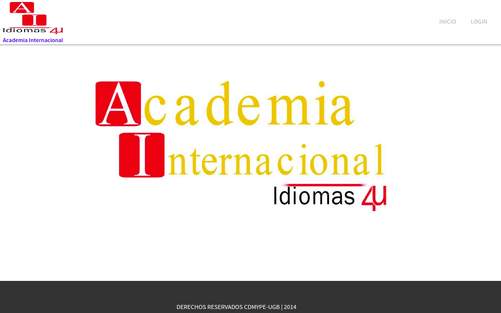
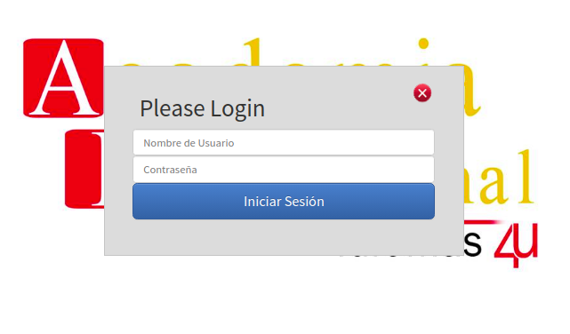
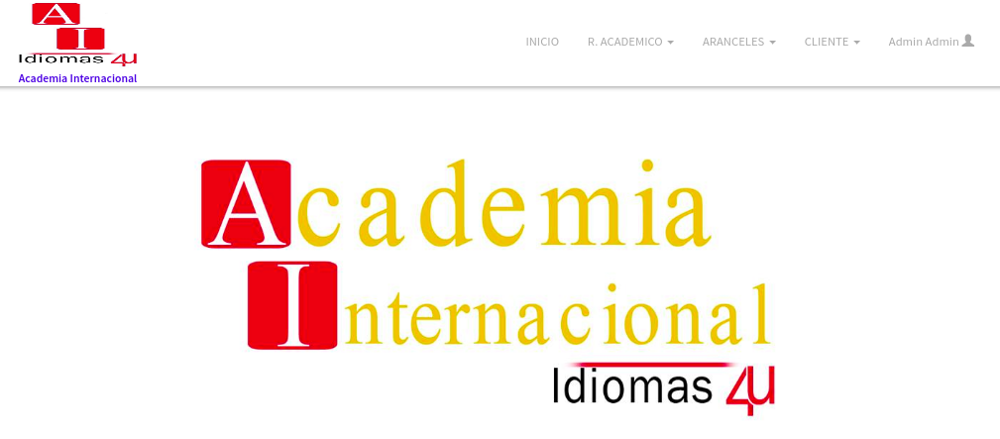
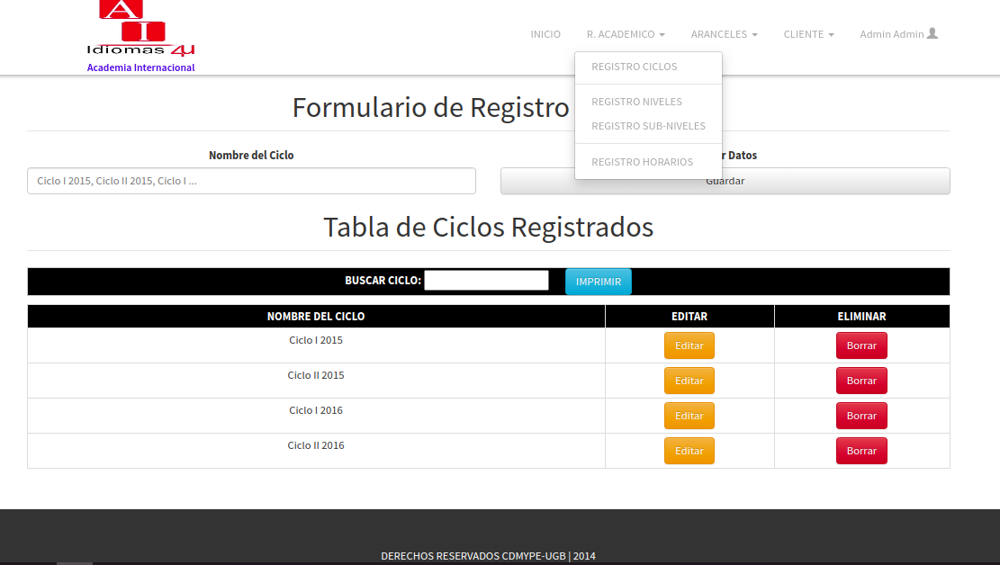

# Proyecto: Aplicación Web

El proyeto fue creado en el 2014, Junto a CDMYPE en la UGB, como proyecto para una Empresa que esta institución atiende a continuación muestro imagenes del proyecto.

Comentar tambien, que la aplicación esta desarrollada unicamente con PHP, sin hacer uso de la estructura MVC.

## Pagina de Bienvenida

Aqui podemos observar la primera imagen al acceder a la aplicación web.

## Pagina de Login
Aqui podemos observar lo que sucede al dar clic en login, se nos desplega un modal, que usted puede mover en toda la pantalla e iniciar sesión.

## Pagina principal despues de inicio de sesion

Aqui podemos observar la pantalla principal de la aplicación, tambien un poco sobre el menú que cuenta esta versión.

## Pagina de registro de un Ciclo

Aqui podemos observar una de las paginas de registro dentro de esta aplicación.

